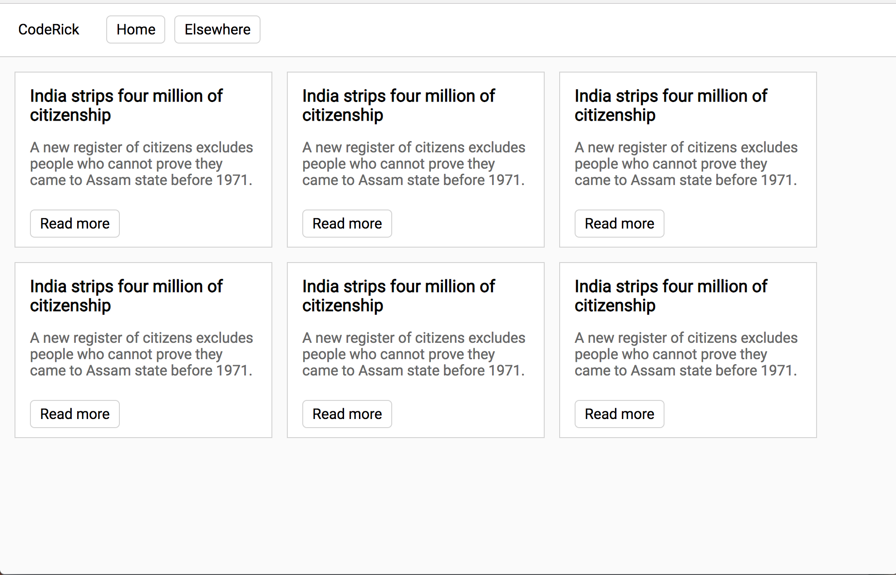
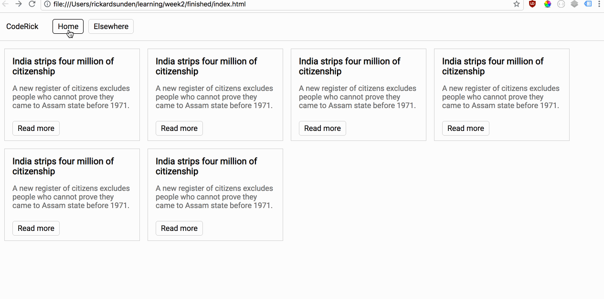

# Week 2
## Objectives
- External libraries (i.e. fonts, css)
- Learn box model
- Normalize.css
- Learn about div elements and layout
- Learn flex box
- Positioning (fixed + absolute) (maybe skip)
- Assign project

## Project: Copy a webpage

Try to get as close as you can using the tech we learned in the class.




You should have a `index.html` and `main.css` file. See the HTML below for what you should start with!

Feel free to add colors and make your own page more intense if you want! I repeated content. Each READ MORE button should take you to some link on the internet.

```html
<!DOCTYPE html>
<html>
<head>
  <title>Project: Week 2</title>
  <link rel="stylesheet" href="https://cdnjs.cloudflare.com/ajax/libs/normalize/8.0.0/normalize.css" />
  <link href="https://fonts.googleapis.com/css?family=Roboto" rel="stylesheet">
  <link rel="stylesheet" type="text/css" href="main.css">
</head>
<body>
 YOUR HTML
</body>
</html>
```

## Resources
- [Google Fonts](https://fonts.google.com/)
- [Guide to Flexbox](https://css-tricks.com/snippets/css/a-guide-to-flexbox/)
- [Normalize CSS](https://necolas.github.io/normalize.css/)
- [CDN for css/js libraries](https://cdnjs.com/)
